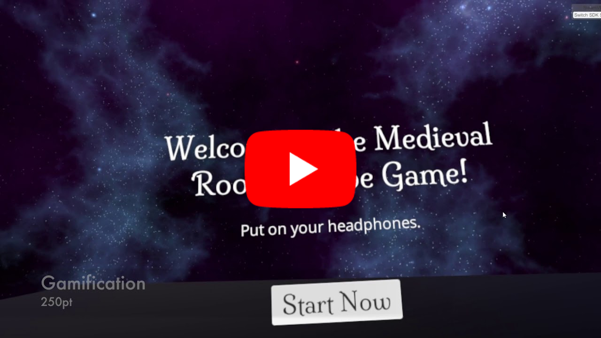

## Achievements

#### Fundamentals (500 points)

1. Scale achievement (100 points): Set the escape room to real-life room scale.
2. Animation achievement (100 points): Implemented the chest open animation.
3. Lighting achievement (100 points): Used baked lights for static objects and light probes for intractable objects.
4. Locomotion achievement (100 points): Implemented both walking and teleporting nav system.
5. Physics achievement (100 points): Implemented gravity for game objects. 

#### Completeness (750 points)

1. Gamification achievement (250 points): It is a game ;)
2. Diegetic UI achievement (250 points): In the game, all objects are diegetic - the keys, the chest, the marbles, the portal, the button, etc. No common UI elements required during the game play.
3. 3D Modeling achievement (250 points): Modeled the escape room and game objects in Blender. (Separate [repo](https://github.com/moyicat/medieval-assets) for those models)

#### Challenges (500 points)

1. User Testing achievement (250 points, 2x if you completed 750 points in Completeness): See `UserTests` folder.