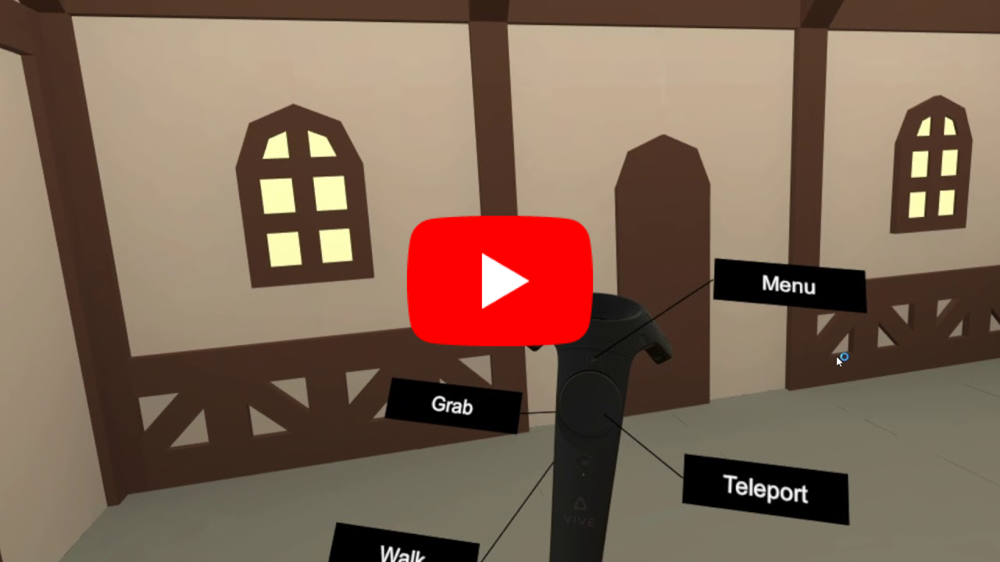

## Pre-Production and Scope Reduction

#### Idea

I am more of a designer than a developer, so I knew I want to find a project that can demonstrate my modeling skills and not rely heavily on programming. I played many Flash room escape games when I grow up, and many real-life room escape games in the past few years. I absolutely love them. The mechanism of those games are rather simple, and the fun part is to design the theme, the scene, and the puzzles. At the same time, VR seems to be the perfect media for a great room escape game experience: it’s provides more freedom than Flash games that you can move around, not constrained by certain “views”, and all objects can be grabbed, not just the clickable ones; and it has no real-life physical constrains. Therefore, to make a VR room escape game was always on my list. 

When I brainstorm about the storyline and the theme of the room, I wanted it to be something that we can’t build in real-life, something only achievable in a virtual world. Then, I saw the medieval game assets contest on SketchFab. And this idea of a time-traveling escape-from-medieval-mastermind game came to life.

#### Things to Build

- Basic Game UI: Welcome, congrats, failed scene and dialog windows. [Done]
- VR UX: Teleport, walk, grab, use, menu. [Done]
- VR UX Tutorial [Done]
- Room Modeling: Exterior and interior objects. [Done]
- Timer, countdown, and record [Done]
- Music, sound effects, narration [Done]
- Opening story video [Feasible]
- Puzzle:
    - Put marbles in correct places = escape [Done]
    - Press button to reveal correct marble orders clue [Done]
    - Use key to open chest [Done]
    - Press the correct melody on the piano to get a clue / marble [Feasible]
    - Use wand with a certain voice command to get a clue / marble [Not sure, probably possible with a plugin]
    - Put the correct plant in the cauldron to get a clue / marble [Feasible]
    - Find a certain place on the globe and point to it to get a clue / marble [Feasible]
    - and more

I ran out of time to implement all the puzzle logic I want, but I solved most of the tech spikes there.

## Emotion

While there’s no one emotion I try to target there, I believe a good game would stimulate many different emotions. 

I tried to convey a sense of excitement and urgency with the opening story; a pleasant feeling when they see the room; a puzzled emotion with the game itself; and a sense of accomplishment when the player successfully beat the game.

## Video Walkthrough

## Resources Used
- Plugins
    - [SteamVR](https://assetstore.unity.com/packages/templates/systems/steamvr-plugin-32647)
    - [VRTK](https://www.assetstore.unity3d.com/en/#!/content/64131)
- Background music
    - [http://soundimage.org/wp-content/uploads/2016/11/Anomaly_Looping.mp3](http://soundimage.org/wp-content/uploads/2016/11/Anomaly_Looping.mp3)
    - [http://soundimage.org/wp-content/uploads/2016/07/RPG-Battle-Climax_v001.mp3](http://soundimage.org/wp-content/uploads/2016/07/RPG-Battle-Climax_v001.mp3)
    - [http://soundimage.org/wp-content/uploads/2016/02/RPG-Intro_v001_Looping.mp3](http://soundimage.org/wp-content/uploads/2016/02/RPG-Intro_v001_Looping.mp3)
- Sound effects
    - [http://soundimage.org/wp-content/uploads/2016/04/PowerUp28.mp3](http://soundimage.org/wp-content/uploads/2016/04/PowerUp28.mp3)
    - [http://soundimage.org/wp-content/uploads/2016/04/PowerDown7.mp3](http://soundimage.org/wp-content/uploads/2016/04/PowerDown7.mp3)
    - [http://soundimage.org/wp-content/uploads/2017/03/Interior-Door_Close.mp3](http://soundimage.org/wp-content/uploads/2017/03/Interior-Door_Close.mp3)
    - [http://soundimage.org/wp-content/uploads/2017/03/Interior-Door_Unlock.mp3](http://soundimage.org/wp-content/uploads/2017/03/Interior-Door_Unlock.mp3)
    - [http://soundimage.org/wp-content/uploads/2016/04/UI_Quirky29.mp3](http://soundimage.org/wp-content/uploads/2016/04/UI_Quirky29.mp3)
    - [http://soundimage.org/wp-content/uploads/2016/04/UI_Quirky32.mp3](http://soundimage.org/wp-content/uploads/2016/04/UI_Quirky32.mp3)
- Voiceover: Mac text-to-speech service, Alex
